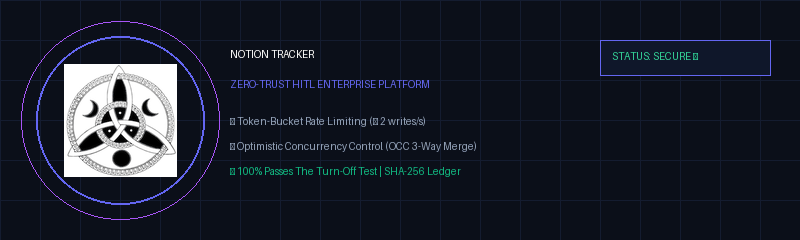
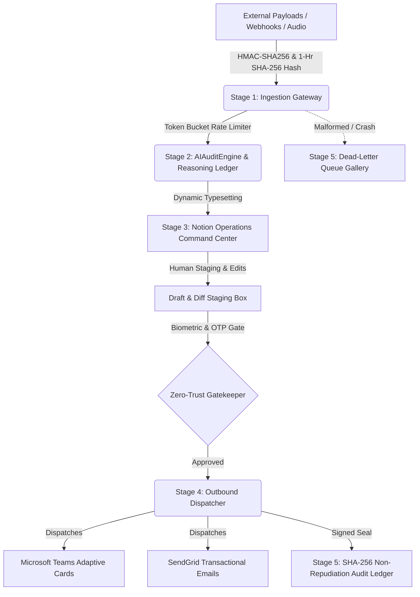

<div align="center">



# 🛡️ Notion Tracker — Enterprise Zero-Trust HITL Platform
### High-Availability Orchestration, Multi-Modal AI Agents, Draft Staging & Non-Repudiation Audit Ledger

[-brightgreen.svg)]()
[]()
[]()
[]()
[]()
[]()

[📊 Download Pitch Deck (.pptx)](notion_tracker_mnc_pitch.pptx) • [🚀 Quickstart](#-quickstart--installation) • [🏗️ Architecture & 5 Stages](#-the-5-stage-enterprise-automation-loop) • [🖥️ 3 UI Layers](#-the-3-unified-ui-layers) • [🧪 Test Verification](#-test-suite--verification) • [🎤 5-Minute Pitch Script](#-5-minute-live-pitch-presentation-script)

</div>

---

## 🌟 Executive Overview & Platform Vision

**Notion Tracker** transforms Notion into a hardened, industrial-grade operational command center for mission-critical enterprise workflows. It eliminates fragile custom JavaScript dashboards by turning native Notion database grids into a resilient, multi-modal human-in-the-loop (HITL) interface backed by:

1. **Deterministic Ingestion Deduplication**: 1-hour cryptographic sliding windows block duplicate submissions.
2. **Cognitive AI Reasoning Ledger**: Natural language justifications written directly to Notion properties explaining *why* decisions were made.
3. **Draft & Diff Staging**: AI pre-compiles outbound dispatches into editable Notion text blocks; human edits override machine outputs.
4. **Dead-Letter Queue (DLQ) View**: Corrupt or failing payloads are safely isolated in a dedicated gallery view with diagnostic tracebacks ("The Turn-Off Test").
5. **Multi-Modal AI Agents**: Gemini 1.5 Flash voice command parsing and `@AI` natural language comment bot with Optimistic Concurrency Control (OCC).



---

## 🖥️ The 3 Unified UI Layers

| UI Layer | URL / Interface | Key Target Audience | Core Capabilities |
| :--- | :--- | :--- | :--- |
| **Layer 1: Native Notion Workspace** | Notion Desktop / Web | Non-Technical Managers & Executives | Drag-and-Drop Operations Grid, Tasks Kanban, DLQ Gallery View, Operator Leaderboard, 100% passes **The Turn-Off Test**. |
| **Layer 2: Streamlit HITL Portal** | `http://localhost:8501` | Operations Officers & Auditors | Biometric Facial Mesh HUD, SMS OTP Gate, OCC 3-Way Merge Conflict Simulator, PDF/Excel Reporting, Day/Night Theme. |
| **Layer 3: Single-Page Web App** | `http://localhost:8000/` | SREs, Developers & Integrators | 100vh locked layout, Live Webhook Simulator, Interactive `@AI` Comment & Voice Agent Console, Real-Time SHA-256 Ledger. |
| **Layer 4: Vercel Production App** | `https://notion-tracker-ai-experts1.vercel.app/` | Global Users & Enterprise Operations | Cloud Serverless Deployment, Fast Execution Edge, Webhook API Gateway. |

---

## 🔄 The 5-Stage Enterprise Automation Loop

### Stage 1: Multi-Modal Ingestion & Deduplication Fingerprinting
- **1-Hour Sliding Window (`3600s`)**: Normalizes payload fields (`lowercase_email + task_date + title + details + source`) and computes a 64-character SHA-256 fingerprint.
- **Quota & Lock Protection**: Duplicate submissions within 1 hour are rejected at the edge before consuming Notion API write quotas.

### Stage 2: AI Decision Engine & AI Reasoning Ledger
- **Explainable AI**: Generates a concise 1–2 sentence natural language explanation justifying risk scores (e.g. `Classified as HIGH risk (91% confidence) under 'Infrastructure' based on access modification scope. Staged pre-compiled dispatch draft for review.`).
- **Dedicated Notion Column**: Programmatically updates the `"AI Reasoning Ledger"` rich-text property and page body callout block.

### Stage 3: Advanced Human-in-the-Loop (Draft & Diff Staging)
- **Draft Staging**: The AI pre-compiles proposed notifications to `Proposed AI Draft`.
- **Human Priority Override**: Operators tweak wording in Notion or the dashboard. The system stores changes in `edited_draft` and dispatches the human-refined text upon approval.

### Stage 4: Outbound Action Engine & Multi-Select Batch
- **Token-Bucket Rate Limiter**: Enforces $\le 2$ writes/sec ($10.0$ capacity) to prevent Notion 429 rate limit exceptions.
- **Multi-Select Batch Execution**: Non-technical users highlight multiple database rows in Notion, right-click, and set `Status = "Approved"`. The daemon dispatches all selected tasks concurrently across worker threads.

### Stage 5: Industrial Observability, DLQ & Tamper-Proof Audit Ledger
- **Dead-Letter Queue (DLQ)**: Quarantines unprocessable payloads into `DLQ: Needs Technical Review` with high-visibility red diagnostic traceback blocks.
- **SHA-256 Audit Chain**: Every transaction generates a tamper-evident cryptographic block hashed to the genesis seal.

---

## 🎙️ Multi-Modal Intelligence Engines

### 1. Notion Natural Language `@AI` Comment Agent
- **Inline Discussion Polling**: In Notion, operators comment `@AI update budget to $4,500` or `@AI re-assess risk`.
- **OCC 3-Way Merge**: The agent updates task attributes without clobbering concurrent human edits.

### 2. Gemini 1.5 Flash Audio-Modal Voice Engine
- **Voice Memo Transcription**: Parses attached `.wav`, `.mp3`, and `.m4a` audio files directly using Gemini Flash audio models.
- **Structured State Transitions**: Automatically extracts budget figures, risk re-evaluations, and approval directives.

---

## 🚀 Quickstart & Installation

### 1. Clone & Setup Environment
```powershell
# Clone the repository
git clone https://github.com/YourOrg/Notion-Tracker.git
cd "Notion Tracker"

# Install Python dependencies
pip install -r requirements.txt
```

### 2. Configure Environment Variables
```powershell
# Copy template and fill Notion API / Gemini API keys
cp .env.example .env
```

### 3. Provision Notion Database Workspace
```powershell
# Provisions Tasks, Run Logs, User Profiles, and Pipeline Templates
python create_databases.py
```

### 4. Launch All Services Concurrently
```powershell
# Starts FastAPI Gateway (8000), Streamlit Dashboard (8501), and Worker Daemon
python run_all.py
```

---

## 🧪 Test Suite & Verification

The test suite covers **35 comprehensive unit tests (100% passing)** across all enterprise layers:

```powershell
# Run the complete test suite
python -m unittest test_tracker.py test_notion_tracker_suite.py -v
```

```text
----------------------------------------------------------------------
Ran 35 tests in 14.685s

OK (35/35 tests passing)
```

### Test Coverage Highlights:
- `test_deduplication_fingerprinting_1hr_window` &rarr; Validates 1-hour deduplication sliding window.
- `test_ai_reasoning_ledger_property` &rarr; Verifies 1-2 sentence AI justification written to Notion column.
- `test_draft_and_diff_staging` &rarr; Validates human operator overrides over AI drafts.
- `test_dead_letter_queue_quarantine` &rarr; Verifies DLQ isolation and red traceback block generation.
- `test_occ_three_way_merge` &rarr; Verifies 3-way merge conflict resolution under concurrent writes.
- `test_voice_memo_and_comment_agent_budget` &rarr; Verifies `@AI` comments and Gemini voice commands.

### Verify Audit Ledger & Run OTP Challenge:
```powershell
# 1. Audit Cryptographic Signatures
python verify_signatures.py

# 2. Test Tamper Detection
python verify_signatures.py --tamper-test

# 3. Interactive Phone OTP Challenge (IN +91)
python verify_signatures.py --otp-challenge
```


<div align="center">
  <sub>Developed with pride by <b>Team AI Experts</b> • Aryan Sharma & Atul Yadav</sub>
</div>

