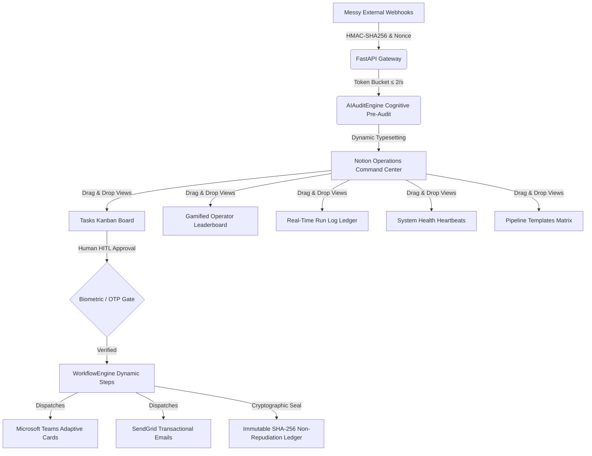

<div align="center">


# 🛡️ Notion Tracker — Enterprise Zero-Trust HITL Platform
### High-Availability Orchestration, Cognitive AI Pre-Audits & Non-Repudiation Audit Ledger

[-brightgreen.svg)]()
[]()
[]()
[]()
[]()
[]()

[📊 Download MNC Pitch Presentation (.pptx)](notion_tracker_mnc_pitch.pptx) • [🚀 Quickstart](#-quickstart-guide) • [🏗️ Architecture](#-system-architecture) • [🧪 Test Verification](#-verification--testing)

</div>

---

## 🌟 The Winning Notion Pivot: Core Capabilities

**Notion Tracker** transforms Notion into a hardened, high-availability, industrial command center for multi-national corporations. It replaces fragile custom JavaScript dashboards with native, resilient Notion database grids.



---

## 💎 Enterprise Feature Pillars

### 1. 🎛️ Centralized Operations Command Center (Drag-and-Drop Grid)
* **Customizable Multi-Column Layout**: Managers can position the **Tasks Kanban Board**, **Gamified Operator Leaderboard**, **Real-Time Run Log**, and **System Health** side-by-side natively inside Notion.
* **100% Passes "The Turn-Off Test"**: If Python background servers are powered down, the non-technical operator's customized dashboard, Kanban columns, and formulas remain **100% visual, structured, and editable inside Notion**.

### 2. ⚡ Visual Workflow Builder: Pipeline Templates Database
* **No-Code Visual Workflow Matrix**: Operators define dynamic automation pipelines as database rows inside Notion.
* **Multi-Select Execution Steps**:
  1. `1. HMAC Nonce Verify 🛡️`
  2. `2. Cognitive AI Pre-Audit 🧠`
  3. `3. Biometric & OTP Gate 🔐`
  4. `4. Teams Adaptive Card 💬`
  5. `5. SendGrid Email 📧`
  6. `6. SHA-256 Signature Seal 📊`
* **Dynamic Execution Engine (`workflow_engine.py`)**: The daemon polls configured templates and executes matching pipelines dynamically.

### 3. 🏆 Gamified Operator Profiles & Streak Flames
* **Notion-Native Formulas**:
  * **Fire Indicator**: `if(prop("Current Streak") > 0, "🔥 " + format(prop("Current Streak")) + " Days", "💤 Inactive")`
  * **Level Progression**: `"Level " + format(floor(prop("Tasks Completed") / 10) + 1)`
* **Dynamic Badges**: Automatically unlocks `First Review 🏆`, `Speed Auditor ⚡`, `7-Day Streak 🔥`, `Zero-Error Champion 🛡️`, and `100 Tasks Certified 👑`.

### 4. 🌐 Multilingual Typesetting & Zero-Cost Accessibility
* **6 Global Languages**: English (`en`), Spanish (`es`), German (`de`), Japanese (`ja`), Hindi (`hi`), and French (`fr`).
* **Inherited WCAG Standards**: Inherits Notion's enterprise accessibility out-of-the-box: native dark/light mode, ARIA screen-reader optimizations, keyboard shortcuts, and responsive layouts.

### 5. 🛡️ Industrial Zero-Trust Resiliency Guards
* **Token-Bucket Rate Limiter**: Strictly enforces safe write limits ($\le 2$ writes/sec) with automated token replenishment.
* **Optimistic Concurrency Control (OCC)**: Version counters with 3-Way Merge conflict resolution prevent state overwrites during concurrent approvals.
* **Biometric Mesh & SMS OTP Gate**: Physical operator biometric verification required for `CRITICAL` and `HIGH` risk tasks.
* **Cryptographic SHA-256 Ledger**: Chained non-repudiation audit ledger verified from genesis hash.

---

## 🛠️ Quickstart Guide

### 1. Installation & Environment Setup
```powershell
# Clone the repository
git clone https://github.com/YourOrg/notion-tracker.git
cd "Notion Tracker"

# Install dependencies
pip install -r requirements.txt
```

### 2. Database Provisioning
```powershell
# Provisions Tasks, Run Logs, User Profiles, and Pipeline Templates
python create_databases.py
```

### 3. Launching Services
```powershell
# 1. Start the Streamlit Administrative Control Portal
streamlit run dashboard.py

# 2. Start the 60-Minute Persistent Background Automation Daemon
python main.py

# 3. Start the Ingestion Gateway
uvicorn webhook_gateway:app --host 0.0.0.0 --port 8000
```

---

## 🧪 Verification & Testing

### Run Comprehensive Unit Test Suite (11/11 Passing)
```powershell
python -m unittest test_tracker.py -v
```
```text
test_ai_pre_audit_and_typesetting ... ok
test_multilingual_notion_typesetting_and_localization ... ok
test_notion_run_log_typesetting_and_dual_toggles ... ok
test_pipeline_templates_and_workflow_execution ... ok
test_system_health_heartbeat_and_turn_off_test ... ok
test_user_profiles_gamification_and_streaks ... ok
test_voice_memo_and_comment_agent_budget ... ok
test_hmac_and_nonce_guards ... ok
test_occ_three_way_merge ... ok
test_daemon_batch_query_and_60m_config ... ok
test_rate_limiter_behavior ... ok

----------------------------------------------------------------------
Ran 11 tests in 1.319s

OK (11/11 tests passed)
```

### Run Cryptographic Ledger Integrity Check
```powershell
python verify_signatures.py
```
```text
=================================================================
 [AUDIT] NOTION TRACKER INDUSTRIAL AUDIT LEDGER INTEGRITY CHECK
=================================================================

Audit Status:            [OK] SECURE
Recalculated Records:    129
Mismatches Detected:     0
Signature Chain Valid:   VALID

[+] Verification Result: All deterministic SHA-256 signatures are cryptographically sound.
```

---

## 📊 Presentation Deck

The complete MNC pitch deck is available at:
* **[`notion_tracker_mnc_pitch.pptx`](notion_tracker_mnc_pitch.pptx)** — 16:9 Widescreen Presentation Deck with embedded dark-tech branding, architectural breakdowns, and competition verification metrics.

---

<div align="center">
  <sub>Built by <b>Team AI Experts</b> | Aryan Sharma (Lead Architect) & Atul Yadav (QA & Security)</sub>
</div>
